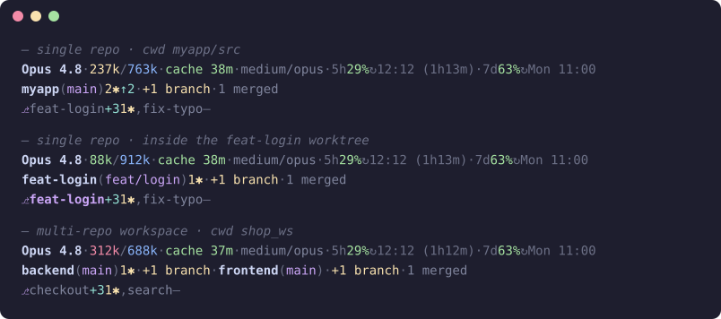

# claude-statusline

A three-line status line for [Claude Code](https://docs.anthropic.com/en/docs/claude-code): model and context depth, rate-limit windows that stay correct across sessions, and per-repo git state including linked worktrees.



Real output of the script over synthetic fixtures — regenerate with `sh docs/render-demo.sh | python3 docs/ansi2svg.py > docs/statusline.svg`.

## What each line shows

**Line 1 — session.** Model · used/remaining context · effort/advisor · rate limits.

- Context depth is coloured by **absolute tokens**, not percentage of window: <200k green, 200k yellow, 250k orange, 300k red. On a 1M model 400k reads as "40%" and colours green, while turns at that depth run ~1.5x slower than the same session's sub-100k baseline — depth is the binding constraint, not overflow. Percentage still governs on small windows; whichever reads more urgent wins.
- Depth is read from the transcript as the **max over a turn's iterations**, not the top-level sum Claude Code reports: a multi-iteration turn inflates `total_input_tokens` ~2x, enough to jump two colour bands.
- Rate limits show the 5-hour and 7-day windows with reset time. Both slots always render; `5h —` means "no live data for this window", never a stale figure.

**Line 2 — git.** One entry per repo: `name(branch)`, then only the counters that are non-zero — `N✱` uncommitted files, `↑N`/`↓N` against upstream, `+N branches` unmerged into trunk, `N merged` branches safe to delete (trunk and anything checked out in a worktree are excluded).

**Line 3 — worktrees.** Each linked worktree of the repo with its commits ahead of trunk and dirty files. The worktree you are in is pinned first; past three names the rest collapse to `+N`; a worktree with neither commits nor changes shows `—` (finished or abandoned). Omitted when there are none.

## Layouts

Nothing to configure — the script reads the session's working directory and picks the layout:

| Working directory | Line 2 | Line 3 |
|---|---|---|
| Anywhere inside a git repo (its root, a subdirectory, a linked worktree) | that repo | `git worktree list` of it, minus the main checkout — plain `git worktree add` and Claude Code's `.claude/worktrees/<name>` alike |
| A folder that is not a repo but holds repos | one entry per immediate child repo | — |
| Inside a `<name>_ws` folder (optional convention, see below) | the workspace repo and/or every child repo | sibling `<name>_ws-wt-<slug>` folders |

The `_ws` convention is for multi-repo workspaces: a folder `shop_ws/` holding `backend/` and `frontend/` as independent repos. A worktree there is a *sibling* folder `shop_ws-wt-<slug>/` with the same sub-repos, counted as one unit — its commits and changes are summed across sub-repos, and the roster is derived from folder names at zero git cost. If you do not name folders that way, the convention never triggers.

## Rate limits across sessions

Claude Code hands each session its own `rate_limits` snapshot, taken at that session's last API response. Per the [docs](https://code.claude.com/docs/en/statusline), each window may be independently absent and a window is dropped once its `resets_at` passes — so an idle session carries a stale `seven_day` and no `five_hour` at all.

The script keeps one account-wide cache (`~/.claude/rate-limits-cache.json`) and merges **per window, from the data itself**: same `resets_at` → higher `used_percentage` wins (usage is cumulative); later `resets_at` → newer window wins; expired → dropped. No clock is involved, so an idle session can never publish a stale snapshot over a live one.

## Install

Requires `jq` and `git` (POSIX `sh`; macOS or Linux).

```bash
git clone https://github.com/yacb2/claude-statusline.git
cd claude-statusline
./install.sh
```

This copies `statusline-command.sh` to `~/.claude/` and sets `statusLine` in `~/.claude/settings.json` (backup written first, skipped when already set). Re-run after pulling to update.

## Tests

```bash
sh tests/test-rate-limits.sh
sh tests/test-worktree.sh
```

Both are self-contained POSIX `sh`: fixtures are built in a temp dir and `HOME` is redirected, so they never read or write your real cache or settings.

## License

MIT
